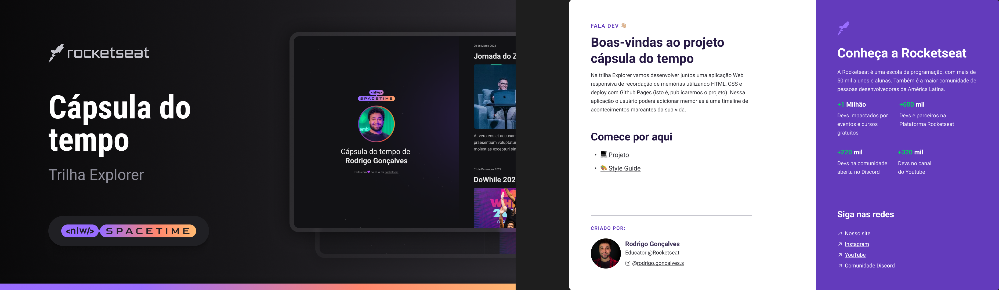

# Cápsula do tempo

  

## 🖥️ Projeto
Este é um projeto Web Responsivo de uma cápsula do tempo, para exibir memórias de uma linha do tempo.

## 🚀 Tecnologias
Esse projeto foi desenvolvido durante o NLW da Rockeatseat com as seguintes tecnologias:

- HTML
- CSS
- Git e Github

## 🏷️ Layout
Você pode visualizar o layout do projeto através do [desse link](https://www.figma.com/file/9kDfweEmEWfLRM6UsbbJSA/C%C3%A1psula-do-tempo-%E2%80%A2-Trilha-Explorer?type=design&node-id=306%3A3&t=ojhYhHcVgdMUHAgI-1).
É necessário ter uma conta no [Figma](https://www.figma.com)